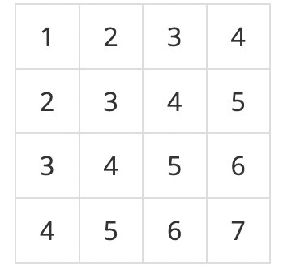

# 18. 누적 합

## [1. 11659 - 구간 합 구하기 4](https://github.com/laphayen/coding_test_python/tree/main/BAEKJOON/18.%20%EB%88%84%EC%A0%81%20%ED%95%A9/11659.py)
* 문제
	* 수 N개가 주어졌을 때, i번째 수부터 j번째 수까지 합을 구하는 프로그램을 작성하시오.

* 입력
	* 첫째 줄에 수의 개수 N과 합을 구해야 하는 횟수 M이 주어진다. 둘째 줄에는 N개의 수가 주어진다. 수는 1,000보다 작거나 같은 자연수이다. 셋째 줄부터 M개의 줄에는 합을 구해야 하는 구간 i와 j가 주어진다.

* 출력
	* 총 M개의 줄에 입력으로 주어진 i번째 수부터 j번째 수까지 합을 출력한다.

* 제한
	* 1 ≤ N ≤ 100,000
	* 1 ≤ M ≤ 100,000
	* 1 ≤ i ≤ j ≤ N

* 예제 입력1
<pre><code>5 3
5 4 3 2 1
1 3
2 4
5 5</code></pre>

* 예제 출력1
<pre><code>12
9
1</code></pre>

* 출처
	* 문제를 만든 사람: baekjoon
	* 데이터를 추가한 사람: djm03178

* 알고리즘 분류
	* 누적합

* * *

## [4. 10986 - 나머지 합](https://github.com/laphayen/coding_test_python/tree/main/BAEKJOON/18.%20%EB%88%84%EC%A0%81%20%ED%95%A9/10986.py)
* 문제
	* 수 N개 A1, A2, ..., AN이 주어진다. 이때, 연속된 부분 구간의 합이 M으로 나누어 떨어지는 구간의 개수를 구하는 프로그램을 작성하시오.
	* 즉, Ai + ... + Aj (i ≤ j) 의 합이 M으로 나누어 떨어지는 (i, j) 쌍의 개수를 구해야 한다.

* 입력
	* 첫째 줄에 N과 M이 주어진다. (1 ≤ N ≤ 106, 2 ≤ M ≤ 103)

	* 둘째 줄에 N개의 수 A1, A2, ..., AN이 주어진다. (0 ≤ Ai ≤ 109)

* 출력
	* 첫째 줄에 연속된 부분 구간의 합이 M으로 나누어 떨어지는 구간의 개수를 출력한다.

* 예제 입력1
<pre><code>5 3
1 2 3 1 2</code></pre>

* 예제 출력1
<pre><code>7</code></pre>

* 출처
	* 문제를 만든 사람: baekjoon
	* 데이터를 추가한 사람: cs71107

* 알고리즘 분류
	* 수학
	* 누적합

* * *

## [5. 11660 - 구간 합 구하기 5](https://github.com/laphayen/coding_test_python/tree/main/BAEKJOON/18.%20%EB%88%84%EC%A0%81%20%ED%95%A9/11660.py)
* 문제
	* N×N개의 수가 N×N 크기의 표에 채워져 있다. (x1, y1)부터 (x2, y2)까지 합을 구하는 프로그램을 작성하시오. (x, y)는 x행 y열을 의미한다.

	* 예를 들어, N = 4이고, 표가 아래와 같이 채워져 있는 경우를 살펴보자.

	

	* 여기서 (2, 2)부터 (3, 4)까지 합을 구하면 3+4+5+4+5+6 = 27이고, (4, 4)부터 (4, 4)까지 합을 구하면 7이다.

	* 표에 채워져 있는 수와 합을 구하는 연산이 주어졌을 때, 이를 처리하는 프로그램을 작성하시오.

* 입력
	* 첫째 줄에 표의 크기 N과 합을 구해야 하는 횟수 M이 주어진다. (1 ≤ N ≤ 1024, 1 ≤ M ≤ 100,000) 둘째 줄부터 N개의 줄에는 표에 채워져 있는 수가 1행부터 차례대로 주어진다. 다음 M개의 줄에는 네 개의 정수 x1, y1, x2, y2 가 주어지며, (x1, y1)부터 (x2, y2)의 합을 구해 출력해야 한다. 표에 채워져 있는 수는 1,000보다 작거나 같은 자연수이다. (x1 ≤ x2, y1 ≤ y2)

* 출력
	* 총 M줄에 걸쳐 (x1, y1)부터 (x2, y2)까지 합을 구해 출력한다.

* 예제 입력1
<pre><code>4 3
1 2 3 4
2 3 4 5
3 4 5 6
4 5 6 7
2 2 3 4
3 4 3 4
1 1 4 4</code></pre>

* 예제 출력1
<pre><code>27
6
64</code></pre>

* 예제 입력2
<pre><code>2 4
1 2
3 4
1 1 1 1
1 2 1 2
2 1 2 1
2 2 2 2</code></pre>

* 예제 출력2
<pre><code>1
2
3
4</code></pre>

* 출처
	* 문제를 만든 사람: baekjoon
	* 어색한 표현을 찾은 사람: f52985
	* 빠진 조건을 찾은 사람: kyma123

* 알고리즘 분류
	* 다이나믹 프로그래밍
	* 누적 합

* * *
