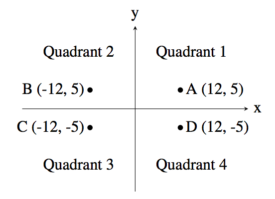

# 2. 조건문

## [1. 1330 - 두 수 비교하기](https://github.com/laphayen/coding_test_python/blob/main/BAEKJOON/2.%20%EC%A1%B0%EA%B1%B4%EB%AC%B8/1330.py)
* 문제
	* 두 정수 A와 B가 주어졌을 때, A와 B를 비교하는 프로그램을 작성하시오.

* 입력
	* 첫째 줄에 A와 B가 주어진다. A와 B는 공백 한 칸으로 구분되어져 있다.

* 출력
	* 첫째 줄에 다음 세 가지 중 하나를 출력한다.
		* A가 B보다 큰 경우에는 '>'를 출력한다.
		* A가 B보다 작은 경우에는 '<'를 출력한다.
		* A와 B가 같은 경우에는 '=='를 출력한다.

* 제한
	* -10,000 ≤ A, B ≤ 10,000

* 예제 입력1
<pre><code>1 2</code></pre>

* 예제 출력1
<pre><code>&#60;</code></pre>

* 예제 입력2
<pre><code>10 2</code></pre>

* 예제 출력2
<pre><code>&#62;</code></pre>

* 예제 입력3
<pre><code>5 5</code></pre>

* 예제 출력3
<pre><code>&#61;&#61;</code></pre>

* 알고리즘 분류
	* 구현

* * *

## [2. 9498 - 시험 성적](https://github.com/laphayen/coding_test_python/blob/main/BAEKJOON/2.%20%EC%A1%B0%EA%B1%B4%EB%AC%B8/9498.py)
* 문제
	* 시험 점수를 입력받아 90 ~ 100점은 A, 80 ~ 89점은 B, 70 ~ 79점은 C, 60 ~ 69점은 D, 나머지 점수는 F를 출력하는 프로그램을 작성하시오.

* 입력
	* 첫째 줄에 시험 점수가 주어진다. 시험 점수는 0보다 크거나 같고, 100보다 작거나 같은 정수이다.

* 출력
	* 시험 성적을 출력한다.

* 예제 입력1
<pre><code>100</code></pre>

* 예제 출력1
<pre><code>A</code></pre>

* 출처
	* 문제를 만든 사람: baekjoon

* 알고리즘 분류
	* 구현

* * *

## [3. 2753 - 윤년](https://github.com/laphayen/coding_test_python/blob/main/BAEKJOON/2.%20%EC%A1%B0%EA%B1%B4%EB%AC%B8/2753.py)
* 문제
	* 연도가 주어졌을 때, 윤년이면 1, 아니면 0을 출력하는 프로그램을 작성하시오.
	* 윤년은 연도가 4의 배수이면서, 100의 배수가 아닐 때 또는 400의 배수일 때이다.
	* 예를 들어, 2012년은 4의 배수이면서 100의 배수가 아니라서 윤년이다. 1900년은 100의 배수이고 400의 배수는 아니기 때문에 윤년이 아니다. 하지만, 2000년은 400의 배수이기 때문에 윤년이다.

* 입력
	* 첫째 줄에 연도가 주어진다. 연도는 1보다 크거나 같고, 4000보다 작거나 같은 자연수이다.

* 출력
	* 첫째 줄에 윤년이면 1, 아니면 0을 출력한다.

* 예제 입력1
<pre><code>2000</code></pre>

* 예제 출력1
<pre><code>1</code></pre>

* 예제 입력2
<pre><code>1999</code></pre>

* 예제 출력2
<pre><code>0</code></pre>

* 출처
	* 문제의 오타를 찾은 사람: jh05013
	* 잘못된 데이터를 찾은 사람: rory143

* 알고리즘 분류
	* 수학
	* 구현
	* 사칙연산

* * *

## [4. 14681 - 사분면 고르기](https://github.com/laphayen/coding_test_python/blob/main/BAEKJOON/2.%20%EC%A1%B0%EA%B1%B4%EB%AC%B8/14681.py)
* 문제
	* 흔한 수학 문제 중 하나는 주어진 점이 어느 사분면에 속하는지 알아내는 것이다. 사분면은 아래 그림처럼 1부터 4까지 번호를 갖는다. "Quadrant n"은 "제n사분면"이라는 뜻이다.

	

	* 예를 들어, 좌표가 (12, 5)인 점 A는 x좌표와 y좌표가 모두 양수이므로 제1사분면에 속한다. 점 B는 x좌표가 음수이고 y좌표가 양수이므로 제2사분면에 속한다.
	* 점의 좌표를 입력받아 그 점이 어느 사분면에 속하는지 알아내는 프로그램을 작성하시오. 단, x좌표와 y좌표는 모두 양수나 음수라고 가정한다.

* 입력
	* 첫 줄에는 정수 x가 주어진다. (−1000 ≤ x ≤ 1000; x ≠ 0) 다음 줄에는 정수 y가 주어진다. (−1000 ≤ y ≤ 1000; y ≠ 0)

* 출력
	* 점 (x, y)의 사분면 번호(1, 2, 3, 4 중 하나)를 출력한다.

* 예제 입력1
<pre><code>12
5</code></pre>

* 예제 출력1
<pre><code>1</code></pre>

* 예제 입력2
<pre><code>9
-13</code></pre>

* 예제 출력2
<pre><code>4</code></pre>

* 출처
	* Olympiad > Canadian Computing Competition & Olympiad > 2017 > CCC 2017 Junior Division 1번
	* 문제를 번역한 사람: jh05013

* 알고리즘 분류
	* 구현
	* 기하학

* * *
